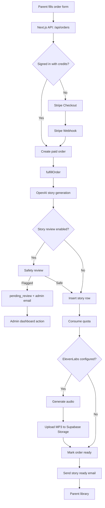
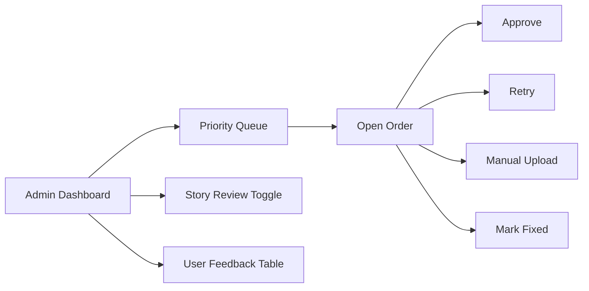

# Moonlight Architecture

Moonlight is an AI bedtime story platform with payments, account libraries, asynchronous story/audio fulfillment, and admin operations.

## Main Components

- **Next.js App Router**: user-facing pages, admin pages, and API routes.
- **Supabase Auth + Database**: user accounts, orders, stories, subscriptions, feedback, and admin runtime flags.
- **Stripe**: checkout, subscription, portal, and webhook-driven payment events.
- **OpenAI**: generates story text and optional safety review decisions.
- **ElevenLabs**: converts story text into audio.
- **Supabase Storage**: stores generated audio files.
- **Admin Dashboard**: monitors orders, retries fulfillment, toggles story review, handles feedback, and marks operational issues fixed.

## Data Flow Diagram

## Operational Flow

## Design Notes

- Fulfillment is intentionally two-phase: text first, audio second. This allows users to read text even if audio fails.
- Orders are stateful and retryable. Admin tools exist because AI/audio integrations can fail asynchronously.
- Some schema decisions are pragmatic for beta speed. A later 3NF migration plan exists, but production stability is prioritized over destructive purity.
