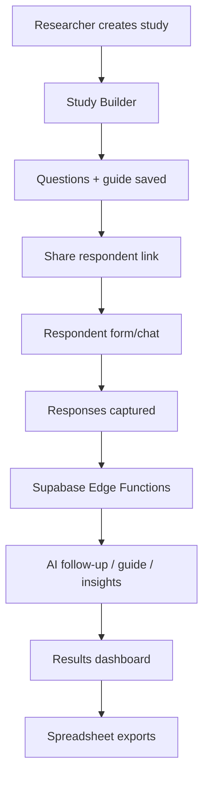
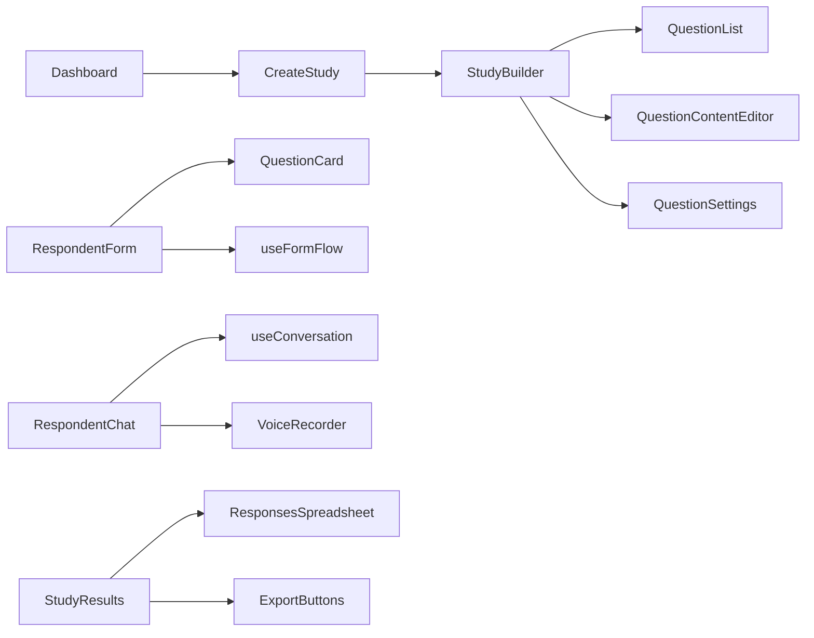

# Solyns AI Form Architecture

Solyns AI Form is a form/research workflow product for creating AI-assisted studies, collecting responses, and generating insights.

## Main Components

- **React + Vite frontend**: study builder, respondent experience, dashboard, and results pages.
- **Builder components**: question list, content editor, settings, and element picker.
- **Respondent flow**: guided form answering, chat-style experience, progress tracking, voice input.
- **Supabase**: persistence and edge functions for AI workflows.
- **AI edge functions**: guide generation, conversation, transcription, insights, and completion handling.
- **Exports/analytics**: spreadsheet generation and response summaries.

## Data Flow Diagram

## Component Flow

## Design Notes

- The builder separates question structure from respondent presentation.
- Hooks encapsulate flow state (`useFormFlow`) and conversational state (`useConversation`).
- Edge functions isolate AI calls from the client, keeping API keys server-side.
- Export utilities keep reporting logic out of UI components.
